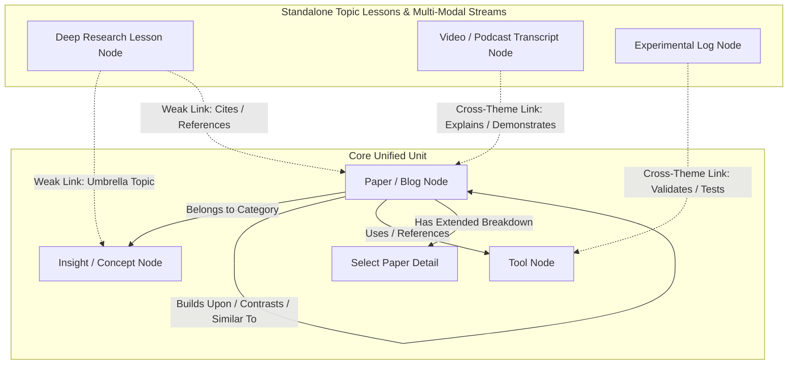

# Project Specification: Graph-Memex (Agentic Knowledge Graph & Multi-Modal Intake Engine)

> **Document Purpose**: This specification is designed to serve as an input specification for DeepResearch / LLM Planner tools to conduct a comprehensive literature review, evaluate UI/DB technology options, and generate a detailed architecture & implementation plan for **Graph-Memex**.

---

## 1. Overview & Motivation

The current research workflow relies on reading daily paper additions and maintaining multiple markdown files within the `docs/` directory:
- **`deeper_read_notes.md`**: Maintained list of papers with short (~2-line) summaries, plus a consolidated tool list at the bottom.
- **`overall_insights.md`**: Manually maintained reverse index grouping similar papers into conceptual themes, architectural patterns, and paradigm clusters (e.g., VLA Decoupling, World Models, Diffusion Policies).
- **`select_papers.md`**: Detailed deep-dive notes for selected high-priority papers, including notes on technical blogs, articles, and surveys.
- **Deep Research Documents**: Standalone topic-focused research files providing comprehensive lessons on specific domains (e.g., `jepa_deep_dive.md`, `generative_notes.md`, `rl_landscape.md`, `data_engineering_stack.md`).

*(Note: `reports/` directory is explicitly excluded from this workflow).*

### Core Problem
1. **Manual Overhead & Scrolling**: Reviewing hundreds of papers daily via linear file scrolling is inefficient.
2. **Fragmented Context**: Manually linking new papers to past papers or updating reverse-index clusters in `overall_insights.md` requires high cognitive load and manual multi-file edits.
3. **Implicit Relationships**: Relationships between papers, technical blogs, tools, and overarching topic lessons are implicit rather than visually navigable.

---

## 2. Strategic Scope: From Paper Notes to High-Volume Content Engine

While Phase 1 targets the paper research notes in `docs/`, the **long-term vision** of this architecture is to serve as an **Ultra-Fast High-Volume Knowledge Intake Engine**:

```
+-----------------------------------------------------------------------------------+
|                        Multi-Theme Knowledge Intake Engine                        |
+-----------------------------------------------------------------------------------+
  |                                 |                                 |
  v                                 v                                 v
+-----------------------+ +-----------------------+ +-------------------------------+
| Theme A: Paper Notes  | | Theme B: Video/Audio  | | Theme C: Engineering & Code  |
|  - deeper_read_notes  | |  - YouTube Transcripts| |  - Data Engineering Stacks  |
|  - overall_insights   | |  - Lecture Transcripts| |  - Experimental Logs          |
|  - select_papers      | |  - Course Media       | |  - Codebase Repos           |
+-----------------------+ +-----------------------+ +-------------------------------+
```

### Macro Goals:
- **Rapid Comprehension over Massive Data Streams**: Enable the user to digest massive volumes of multi-modal content (hundreds of YouTube video transcripts, lecture recordings, codebases, experimental logs, and research papers) without manually watching or reading through every item line-by-line.
- **Theme-Based Domain Partitioning**: Support isolated or interconnected **Themes/Workspaces**. A single theme might focus on *VLA Paper Research*, while another theme manages *YouTube Technical Transcripts*, and another manages *Experimental Logs*.
- **Cross-Theme Knowledge Bridges**: Allow the agentic backend to discover and link nodes across themes (e.g., linking a paper node in Theme A to a video transcript explanation in Theme B).

---

## 3. Core Architecture & Conceptual Model

### A. The Core Unified Unit (`deeper_read_notes` + `overall_insights` + `select_papers`)
The three main paper-related files form **one tightly-integrated core unit**:
- **Individual Paper Identity**: Every paper has a primary node identity. It starts as a short 2-line summary (`deeper_read_notes.md`). If further analyzed, it expands with detailed breakdowns (`select_papers.md`).
- **Connections & Similarities**: Papers are linked via explicit connections (e.g., common architectures, shared components, contrasting methods).
- **Reverse-Index Clustering**: Papers are grouped under conceptual themes (`overall_insights.md`).

### B. Deep Research Documents & Blog Entries (Lesson-Level / Weak Connections)
- **Deep Research Files** (`jepa_deep_dive.md`, `generative_notes.md`, `rl_landscape.md`): These act as self-contained **lessons or domain curricula**. They have distinct individual identities and are **not** mixed inline with paper nodes.
- **Weak Link Topology**: Connections between deep research topic lessons (or blog summaries in `select_papers.md`) and individual paper nodes are modeled as **weak or high-level structural edges** (e.g., `TOPIC_UMBRELLA`, `SURVEY_REFERENCE`). This prevents dense paper-mesh clutter while preserving high-level context.

---

## 4. Detailed Node Taxonomy & Connection Schema



### Node Types
1. **Paper / Blog Node**: `id`, `title`, `short_summary` (2 lines), `has_detailed_notes`, `tags`, `url`, `date_added`.
2. **Insight / Concept Node (Reverse Index)**: `topic_id`, `category` (e.g., *VLAs > System Architecture & Decoupling*), `summary_takeaways`.
3. **Tool Node**: `name`, `category` (framework, benchmark, dataset, hardware), `referenced_in_papers`.
4. **Deep Research Lesson Node**: `filename`, `topic_name`, `domain`, `weak_links`.
5. **Multi-Modal Transcript Node**: `media_id`, `source` (YouTube, Podcast, Lecture), `transcript_snippet`, `timestamps`, `summary`.
6. **Experimental Log Node**: `run_id`, `experiment_name`, `results_summary`, `linked_tools`.

### Connection Types & Weighting
- **Strong Connections (Paper Mesh)**: `SIMILAR_TO`, `BUILDS_UPON`, `CONTRASTS_WITH`, `GROUPED_IN`.
- **Weak Connections (Higher-Level Context)**: `TOPIC_UMBRELLA`, `BLOG_REFERENCE`, `MEDIA_EXPLAINS`, `EXPERIMENT_VALIDATES`.

---

## 5. Key System Features & Workflows

### A. Manual & Agentic Connection Management
- **Manual Linking**: Easy syntax/UI for adding custom connections between papers or nodes (e.g., `Paper A -> SIMILAR_TO -> Paper B: "shared world model architecture"`).
- **Agent-Suggested Links**: When a new paper, video transcript, or experiment is ingested, an LLM agent analyzes the content against existing context and proposes connections or reverse-index cluster placements based on rules established in `overall_insights.md`.

### B. Exhaustive Review & Curriculum Mode
- Toggle **Curriculum Review Mode**: Traverses graph nodes exhaustively by topic, tag, theme, or cluster path, guaranteeing complete review coverage without missing unread or recent additions.

### C. High-Volume Multi-Modal Ingestion Pipeline
- Ingestion pipelines to parse YouTube video transcripts, lecture audio summaries, raw markdown logs, and arXiv papers into structured nodes effortlessly.

### D. Custom High-Performance Interactive Visualization
- **Graph UI Requirements**:
  - Rich interactive graph rendering (force-directed layout, custom node grouping, theme switching, smooth zoom/pan).
  - Clear visual distinction between **Strong Mesh Edges** and **Weak Structural Edges**.
  - Side drawer displaying complete Markdown notes/transcripts upon clicking any node.
  - Quick-add modal for 2-line capture, transcript submission, and connection tagging.

---

## 6. Technology Stack & Technical Constraints

### A. Database Choice: MongoDB (No Neo4j)
- **Constraint**: Do **NOT** use Neo4j.
- **Storage Model**: **MongoDB** document database.
  - Papers, Insights, Tools, Lessons, and Transcripts stored in dedicated collections partitioned by `theme_id`.
  - Adjacency lists / Graph connections stored via embedded edge arrays with `$graphLookup` aggregation pipelines or dedicated `edges` collection for bidirectional graph traversal.
  - Integrated MongoDB Vector Search for semantic similarity matching across papers, video transcripts, and lessons.

### B. Protocol & Agent Interface: FastMCP Integration
- **Framework**: Leverage **FastMCP** (via LangChain FastMCP or official `mcp` Python SDK).
- **MCP Tools**: Expose agent tools to:
  - Add new paper entries, transcripts, and 2-line summaries.
  - Query graph nodes & edge connections across themes.
  - Suggest/confirm similarity links and insight groupings.
  - Sync bidirectional changes between MongoDB and local Markdown files (`docs/`).

### C. Frontend / UI Library Evaluation
- Custom Web UI built using modern frontend graph rendering libraries (Cytoscape.js, D3.js, `react-force-graph`, Cosmograph, vis.js) capable of multi-theme filtering and high-performance node clustering.

---

## 7. Questions for DeepResearch & Literature Review

DeepResearch should investigate and provide recommendations on the following:

1. **MongoDB Graph & Vector Modeling for Multi-Theme Datasets**:
   - Optimal collection schema for handling multi-type nodes (papers, video transcripts, code logs) across multiple themes with fast bidirectional traversal (`$graphLookup`) and vector search.
2. **FastMCP Integration Architecture**:
   - Best practices for building a FastMCP server in Python/TypeScript to interface an LLM agent with MongoDB graph queries.
3. **Graph Visualization Libraries Comparison for Multi-Modal Nodes**:
   - Compare Cytoscape.js, `react-force-graph`, D3.js, and Cosmograph for rendering mixed-density multi-theme graphs with custom node drawer integration.
4. **Bidirectional Markdown & Ingestion Sync Strategies**:
   - Architecture for keeping static Markdown files (`deeper_read_notes.md`, `overall_insights.md`, `select_papers.md`) in 100% sync with MongoDB documents while ingesting external transcript streams.

---

## 8. Implementation Phasing

- **Phase 1**: MongoDB Schema & FastMCP Backend + Markdown Sync Engine.
- **Phase 2**: DeepResearch literature review & tech evaluation on UI visualization libraries and multi-modal ingestion.
- **Phase 3**: Custom Interactive Graph UI with Node Detail Drawer & Multi-Theme Switching.
- **Phase 4**: Agentic connection discovery, transcript intake pipelines, & curriculum traversal mode.
